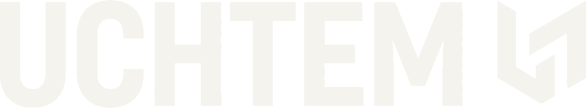

<p align="center">
  
</p>

<p align="center">
  
  
  
  
  
  
  
</p>

Uchtem is a premium financial-management / business-consulting brand website — a bilingual (Ukrainian primary, English secondary) marketing SPA built to read like a private institution, not a generic accounting-firm site.

Every page — home, services, the two service pillars, about, and contact — is fully built and fully bilingual, served at both a Ukrainian-default URL and its `/en` mirror with matching `hreflang`/canonical tags.

## Setup

```bash
git clone <this repo>
cd uchtem
npm install
```

No environment variables or backend to configure — the app is a static SPA with no external services at build/dev time.

## Development

```bash
npm run dev
```

Starts the Vite dev server with HMR at `http://localhost:5173`.

## Production build

```bash
npm run build     # tsc typecheck, then production build to dist/
npm run preview   # serve the dist/ build locally
```

TypeScript `strict: true` is the project's main static check, run as part of `npm run build`. ESLint is not configured.

## Tests

```bash
npm test          # runs the Vitest suite once
npx vitest        # watch mode
```

## Internationalization

Ukrainian is the **primary/default** language; English is secondary. Every route currently ships real, complete copy in both languages.

- **Routing**: `/` and its subpaths render Ukrainian; the identical route tree is mirrored under `/en` (`src/App.tsx`). `Layout` calls `useLocaleSync()` (`src/i18n/locale.ts`) on every navigation to sync i18next's active language and `<html lang>` to whichever prefix is in the URL.
- **Never hardcode an internal `<Link>`/`href`.** Use `useLocalizedPath()` (`lp(path)`) so links stay on the current language — pass a bare, Ukrainian-locale path (e.g. `lp("/contact")`) and it adds `/en` when appropriate. The header's language switcher uses `useOtherLocalePath()`.
- **Translation resources** live in `src/i18n/locales/{ua,en}/*.json`, registered in `src/i18n/index.ts`. `common` covers global chrome (nav, footer, CTA button); every other route has its own namespace (`home`, `services`, `financialManagement`, `businessConsulting`, `about`, `contact`, `legal`, `notFound`).
- **Adding a new string**: add it to both locale JSON files under the relevant namespace, then read it with `useTranslation("<namespace>")`.
- **SEO**: `Seo.tsx` emits `hreflang` alternates (`uk`, `en`, `x-default`) and a locale-correct canonical URL from the bare path each route passes in — routes keep passing the Ukrainian-locale path (e.g. `path="/services"`) regardless of the active language; `Seo` handles the `/en` prefixing itself.

## File structure

```
uchtem/
├── index.html                  Vite entry HTML
├── public/                     Static assets (logos, mascot, sitemap.xml, robots.txt)
└── src/
    ├── main.tsx                React root
    ├── App.tsx                 Route table — Ukrainian tree + mirrored /en tree
    ├── styles/index.css        Tailwind entry + @theme design tokens
    ├── components/
    │   ├── backgrounds/         Hero background visual (DotGrid, ported from react-bits)
    │   ├── base/                Restyled form/button primitives (button, input, select, form, ...)
    │   ├── data-viz/            AnimatedStat, MinimalLineChart
    │   ├── layout/               Header, Footer, Layout, Seo
    │   ├── sections/             Page sections shared across routes (Hero, ServicesGrid,
    │   │                        TwoPillars, Method, ContactSection, CtaBand, ...)
    │   └── ui/                   Small shared primitives (Reveal, TypewriterText)
    ├── i18n/
    │   ├── index.ts              i18next setup + namespace registration
    │   ├── locale.ts             useLocalizedPath / useOtherLocalePath / useLocaleSync
    │   └── locales/{ua,en}/      Per-namespace translation JSON, both languages complete
    ├── lib/
    │   └── formspree.ts          Contact form submission helper (placeholder form ID)
    ├── routes/                   One file per page (Home, Services, FinancialManagement,
    │                            BusinessConsulting, About, Contact, Legal, NotFound)
    └── utils/
```

## Demo


## Known gaps

- Favicon/OG image are still placeholders — need real brand assets.
- Contact form posts to a placeholder Formspree endpoint (`src/lib/formspree.ts`) — swap in a real form ID before launch.

## License

[PolyForm Noncommercial License 1.0.0](LICENSE) — free to use, modify, and reuse (including individual components) for noncommercial purposes. Using this repository, or code from it, to generate revenue or other commercial advantage is not permitted.
